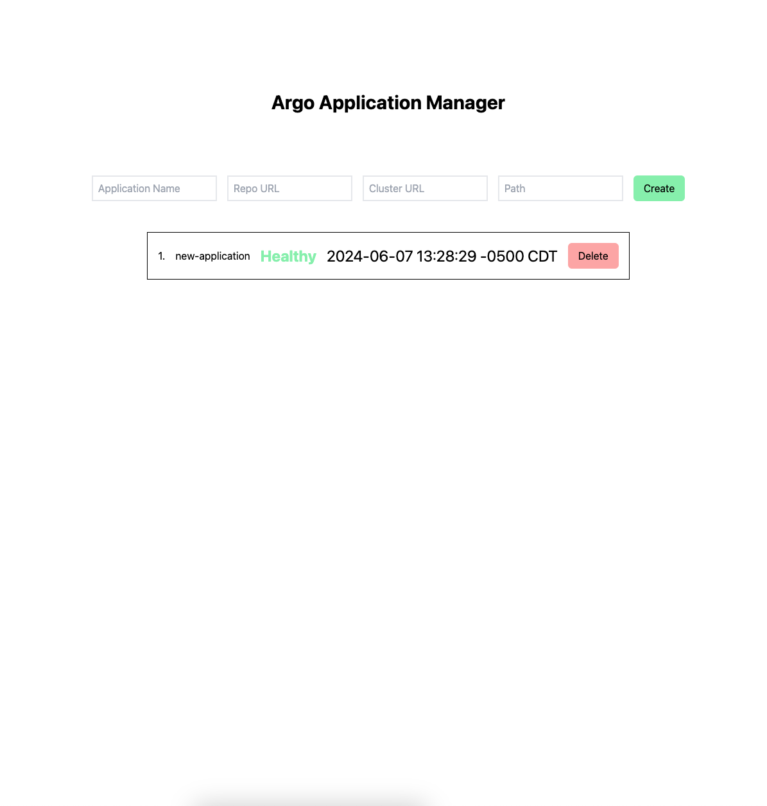

# Hyperbolic Interview

## Task at hand

We are tasked with creating a CRUD type of controller that can run in Kubernetes for managing Argo Applications. The operations on these applications include creation, deletion, and listing.

The following structure of the code is:

1. `.`: contains the backend code for the application that interfaces with the k8s API
2. `frontend`: contains React + Vite code to interface with the backend to do certain operations against the k8s cluster
3. `kubernetes`: contains all the manifests to get the Go binary running and making operations against the cluster within the cluster

## Run Modes

You can run this code locally on your machine, or use any minified k8s distribution with [ArgoCD](https://argo-cd.readthedocs.io/en/stable/) installed on it. For this purpose, I went with what I was most familiar with, [minikube](https://minikube.sigs.k8s.io/docs/).

Make sure you create the `argocd` namespace on your machine before installing ArgoCD itself.

### Locally

If you want to run this code locally, these are the steps you should take:

1. Build the `frontend` code from the directory:
   ```bash
   cd frontend
   npm install
   npm run build
   ```
2. Run the Go service from the root
   ```bash
   go run main.go
   ```

Remember that you need the k8s distribution running on your machine, and your kube context should be pointing to that running k8s distribution (since you could have other clusters you are authenticated to on your machine).

### Remotely

If you want to run this code within a kubernetes cluster, you would need to take several steps:

1. Run a k8s distribution (minikube)
   ```bash
   minikube start
   ```
2. Apply the `permissions.yaml` manifest. It might not be necessary, but these permissions scope the service to do those following operations against the k8s API
   ```bash
   kubectl apply -f kubernetes/permissions.yaml
   ```
3. Build and load the Docker image into `minikube`

   ```bash
   docker build -t hyperbolic-interview:latest .
   docker image save -o hyperbolic-interview.tar hyperbolic-interview:latest
   minikube image load hyperbolic-interview:latest
   ```

   The Docker image bakes the `frontend` build into its final directory structure, so Go can embed the file system within its binary.

4. Once this image is loaded, then you can apply the deployment

   ```bash
   kubectl apply -f kubernetes/deploymen-service.yaml
   ```

   This manifests contains a simple `Deployment` and `Service` for the `hyperbolic-interview` service

We do not expose this behind a Cloud LB at the moment but theoretically you could use any Cloud that offers LoadBalancing as a service, and leverage a k8s ingres-controller like [nginx](https://github.com/kubernetes/ingress-nginx) for routing Ingress to the `hyperbolic-controller`.

With the above in mind we can just port forward the pod, and access our Deployment! You can either do this through the pod definition or the k8s service definition.

```bash
kubectl port-forward svc/hyperbolic-controller 8080:8080
```

## Actual Application

The actual application contains a simple UI. Here is a screenshot of what it looks like:



You can Create/Delete and List the Argo Applications in your k8s cluster now!

For now we expect the following input:

1. Application Name: name of your Argo application
2. Repository URL: repository that Argo will pull from to reconcile changes in your cluster
3. Cluster URL: the target k8s cluster that Argo should apply the changes to
4. Path: the path where your k8s manifests will live
